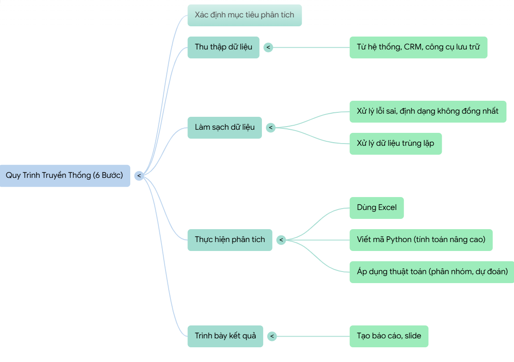
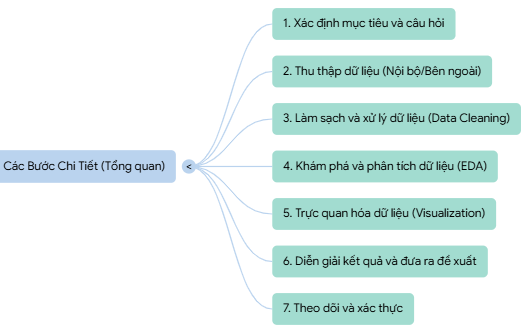
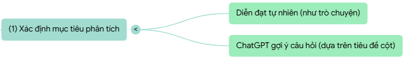
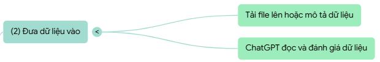
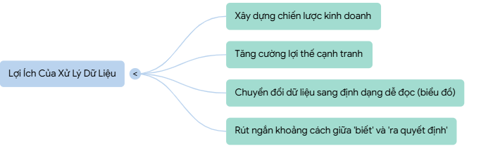
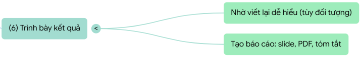

# I. Quy trình phân tích dữ liệu

## 1. Quy trình Truyền thống:

## 2. Các bước chi tiết:

## 3. Lợi ích của xử lý dữ liệu:

# II. Qui trình tham khảo với ChatGPT
## 4.1

## 4.2

## 4.3

## 4.4

## 4.5

## 4.6

# III. PROMPT gợi ý TỪNG BƯỚC:
### Bước 1: Xác định mục tiêu và câu hỏi

Prompt gợi ý:
Tôi có một tập dữ liệu trong file CSV tên dulieumau_vck_test_gpt.csv. Hãy đọc và cho tôi biết:
- Dữ liệu này chứa những cột nào, loại dữ liệu của từng cột.
- Dữ liệu này phù hợp để trả lời những câu hỏi kinh doanh/định hướng phân tích nào.
- Hãy đề xuất một số mục tiêu phân tích có thể thực hiện với tập dữ liệu này.

### Bước 2: Thu thập dữ liệu
Prompt gợi ý:
Với file dữ liệu dulieumau_vck_test_gpt.csv mà tôi cung cấp, bạn hãy:
- Nhận xét xem dữ liệu này có đủ để phục vụ mục tiêu phân tích đã đề xuất ở Bước 1 hay không.
- Đề xuất thêm các loại dữ liệu khác (nếu cần) nên thu thập bổ sung để phân tích đầy đủ hơn.
- Nêu rõ lý do tại sao cần các dữ liệu bổ sung đó.

### Bước 3: Làm sạch và xử lý dữ liệu
Prompt gợi ý:
Hãy phân tích dữ liệu trong dulieumau_vck_test_gpt.csv và cho tôi biết:
- Có bao nhiêu giá trị bị thiếu (missing values), trùng lặp hoặc sai định dạng.
- Bạn sẽ đề xuất các bước làm sạch dữ liệu nào? (ví dụ: loại bỏ dòng, thay thế giá trị thiếu, chuẩn hóa đơn vị, đổi kiểu dữ liệu, …).
- Hãy đưa ra ví dụ code Python/Pandas để minh họa quá trình làm sạch này.

### Bước 4: Khám phá và phân tích dữ liệu

Prompt gợi ý:
Dựa trên dữ liệu sau khi làm sạch, hãy giúp tôi:
- Thống kê mô tả cơ bản (mean, median, min, max, std) cho các cột số liệu.
- Tìm mối quan hệ hoặc xu hướng chính trong dữ liệu (ví dụ: tương quan giữa các biến, yếu tố ảnh hưởng đến doanh số, …).
- Đưa ra nhận xét ngắn gọn về các phát hiện từ dữ liệu.

### Bước 5: Trực quan hóa dữ liệu

Prompt gợi ý:
Từ dữ liệu đã phân tích, hãy tạo các biểu đồ trực quan sau:
- Biểu đồ phân bố giá trị cho cột số liệu chính.
- Biểu đồ so sánh giữa các nhóm (nếu có cột phân loại).
- Biểu đồ thể hiện xu hướng theo thời gian (nếu có cột ngày/tháng).
Hãy dùng python và xuất code minh họa.

### Bước 6: Diễn giải kết quả và đưa ra đề xuất

Prompt gợi ý:
Từ kết quả phân tích và trực quan hóa ở các bước trước, bạn hãy:
- Trả lời các câu hỏi/mục tiêu phân tích đã xác định ở Bước 1.
- Tóm tắt các phát hiện quan trọng.
- Đề xuất giải pháp hoặc hành động cụ thể dựa trên dữ liệu.

### Bước 7: Theo dõi và xác thực

Prompt gợi ý:
Sau khi đã phân tích dữ liệu dulieumau_vck_test_gpt.csv, bạn hãy cho tôi biết:
- Làm thế nào để theo dõi hiệu quả của các đề xuất trong thực tế.
- Những chỉ số (KPI) nào nên được giám sát định kỳ.
- Cách cập nhật và cải thiện quy trình phân tích khi có dữ liệu mới.
